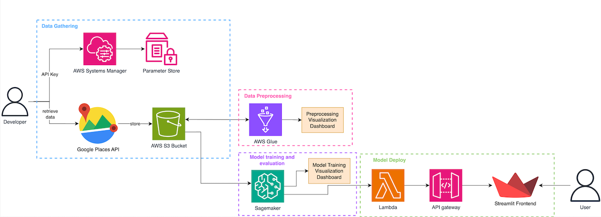

# Hotel Recommendation System using Google Places API and AWS Cloud Services


This project implements a complete CI/CD ML Pipeline that gathers hotel information from the Google Places API, stores it in an AWS S3 bucket, and utilizes AWS tools to preprocess, visualize, train, evaluate, and deploy the ML model.

## Table of Contents

- [Architecture](#architecture)
- [Installation](#installation)
- [Pre-requisites](#pre-requisites)
- [Usage](#usage)
- [License](#license)
- [Contact](#contact)

## Architecture

### Flow of the Architecture


### First Architectural Diagram



## Pre-requisites

This project requires both a Google Cloud account and an AWS account.

### AWS Account Setup

To create an AWS Free Tier account, visit the [AWS Console](https://signin.aws.amazon.com/signin?redirect_uri=https%3A%2F%2Faws.amazon.com%2Fmarketplace%2Fmanagement%2Fsignin%3Fref_%3Dfooter_nav_management_portal%26state%3DhashArgs%2523%26isauthcode%3Dtrue&client_id=arn%3Aaws%3Aiam%3A%3A015428540659%3Auser%2Faws-mp-seller-management-portal&forceMobileApp=0&code_challenge=p-4NnHTqm3ojLRxexOp1gybjzKDKuir2z2Ko6Q77Vsk&code_challenge_method=SHA-256), click on "Create a new AWS account," and follow the recommended steps.

Once you have access to the console, it is recommended to set up billing to ensure you do not exceed your budget. Go to:
Billing and Cost Management > Budgets > Overview and create a "My Zero-Spend Budget".

With your AWS account set up, you can follow the guidelines to create and set up the infrastructure automatically using Terraform. The entire process is detailed in the [Terraform README file](tf/README.md).

### Google Cloud Account Setup

To set up a Google Cloud account, follow these steps:

1. Go to the [Google Cloud Console](https://cloud.google.com/) and create a new project.
2. Enable billing for your project, as the Places API is a paid service. To ensure you stay within the $300 budget, consider the following costs: [Data Gathering Costs](documentation/billing.md).
3. Create a new project named `AndorraHotelsDataCollection`.
4. Enable the Places API: Navigate to the API Library and enable the "Places API" for your project.
5. Get your API key: Go to the Credentials page and create an API key. This key will be used to authenticate your requests to the Google Places API.

### Set Up Secrets

The final configuration step involves setting up AWS and GitHub secrets to enable GitHub Actions. While the API secrets can be tested locally, they must be stored securely for CI/CD pipeline execution. 

To use AWS Systems Manager Parameter Store:

1. Go to the AWS Management Console.
2. Navigate to “AWS Systems Manager” > "Parameter Store".
3. Create three new parameters for your credentials:
    ```json
    {
        "ADMIN_ACCESS_KEY_ID": "aws_access_key_id",
        "ADMIN_SECRET_ACCESS_KEY": "aws_secret_access_key",
        "GOOGLE_PLACES_API_KEY": "google_places_api_key"
    }
    ```
    - Select "Standard" tier and "Secure String".
4. A function called `get_secrets()` was created to retrieve this information.

For GitHub Actions:

1. Go to your GitHub repository.
2. Click on Settings > Secrets and Variables > Actions.
3. Add the following secrets: `AWS_ACCESS_KEY_ID` and `AWS_SECRET_ACCESS_KEY`.

## Usage

### Data Gathering

## Data Gathering

To obtain a dataset containing updated hotels and reviews for the Andorran region, and to ensure it is maintained and updated frequently, the Google Places API was utilized. Once the environment is set up, the only action required to retrieve the raw data into the S3 bucket is to navigate to your GitHub repository, go to Actions, and trigger the `1. Retrieve Hotel Raw Data` GitHub action. If the prerequisites have been set correctly, the GitHub action will pass, and the raw data will be stored in your `andorra-hotels-data-warehouse` bucket.

### Data Extraction Process

The data extraction process is performed by the GitHub action which follows these steps:

1. **Gather AWS and Google Cloud Credentials:**
   The action retrieves the necessary credentials to access both AWS and Google Cloud services.

2. **Access Google Places API:**
   The action uses the credentials to authenticate and connect to the Google Places API.

3. **Make API Requests:**
   - **Find Hotels:** Utilize the Place Search request to find hotels in the specified region.
   - **Get Details:** Use the Place Details request to obtain detailed information about each hotel, including reviews.

4. **Define the Search Requests:**
   - To search for hotels in a specific region (e.g., Andorra la Vella), use the following endpoint:
     ```bash
     https://maps.googleapis.com/maps/api/place/textsearch/json?query=hotels+in+Andorra+la+Vella&key=YOUR_API_KEY
     ```
   - To get detailed information about a specific hotel, including reviews, use the Place Details request:
     ```bash
     https://maps.googleapis.com/maps/api/place/details/json?place_id=PLACE_ID&key=YOUR_API_KEY
     ```

5. **Download Data and Store in S3 Bucket:**
   The action downloads the data, including images, and stores them in the S3 bucket.

6. **Define JSON Dataset Format:**
   The data is structured in the following JSON format:
   ```json
   {
       "hotel_name": "Yomo Imperial Hotel",
       "location": "Avinguda Rocafort, 26, Sant Julià de Lòria",
       "rating": 4,
       "user_ratings_total": 1078,
       "max_number_of_people": 2,
       "address": "Av. Rocafort, 26, AD600 Sant Julià de Lòria, Andorra",
       "business_status": "OPERATIONAL",
       "place_id": "EXAMPLE_PLACE_ID",
       "amenities": {},
       "photos": [
           {
               "photo_reference": "EXAMPLE-PHOTO-REFERENCE",
               "s3_url": "https://andorra-hotels-data-warehouse.s3.amazonaws.com/raw_data/images/Sant Julià de Lòria/Yomo Imperial Hotel/EXAMPLE_PHOTO_NAME.jpg",
               "html_attributions": [
                   "<a href=\"https://maps.google.com/maps/contrib/EXAMPLE_REF\">Yomo Imperial Hotel</a>"
               ]
           },
           ...
       ],
       "reviews": [
           {
               "user": "Example User",
               "rating": 5,
               "date": "a year ago",
               "review": "Example Review"
           },
           ...
       ],
       "source": "https://maps.googleapis.com/maps/api/place/details/json?place_id=EXAMPLE_PLACE_ID"
   }

7. **Resulting Data in S3 bucket:** After execution, the following structure will be present in your S3 bucket: 

    ```
    - andorra-hotels-data-warehouse/
        - raw_data/
            - images/
                - Andorra La Vella/
                    - <Hotel Names>/
                        - <Hotel Image JPG>
                ...
            - text/
                - Andorra La Vella_<Date> JSON
    ```

This structure contains all corresponding images for each hotel as described in the JSON file. The overall process retrieves information for 50 hotels per region and 100 reviews per hotel. Additionally, all available images for each hotel are retrieved. Since Andorra has 7 regions, a total of information for 350 hotels is gathered.

### Data Preprocessing
TODO

### Data Visualization
TODO

### Model Training
TODO

### Model Evaluation
TODO

### Model Deployment
TODO

## License

TODO

## Contact

For questions or feedback, please contact:

- Email: normagutiesc@gmail.com
- GitHub: [Norma-99](https://github.com/Norma-99)