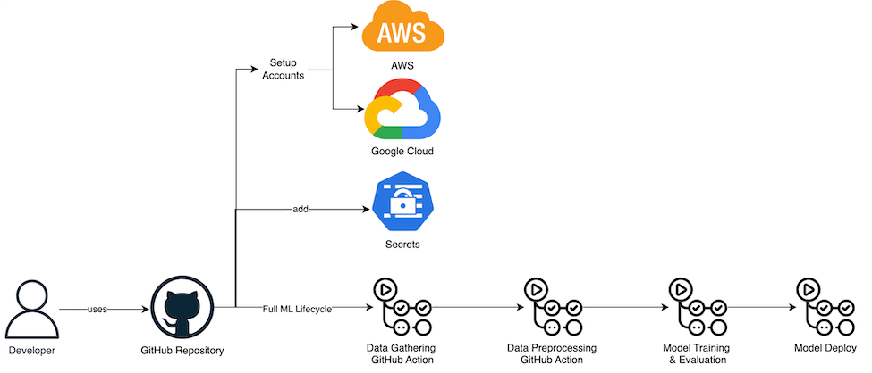
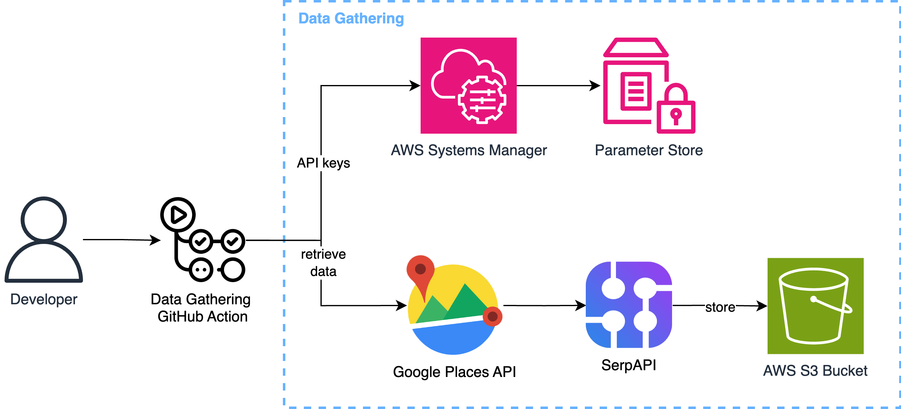
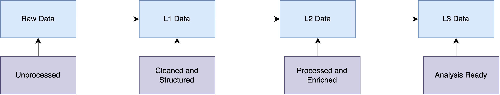
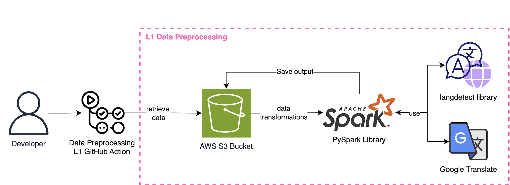
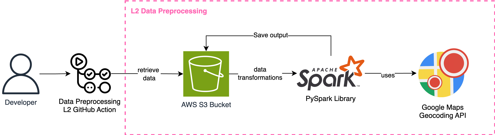
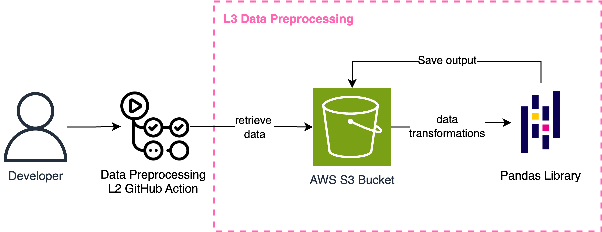
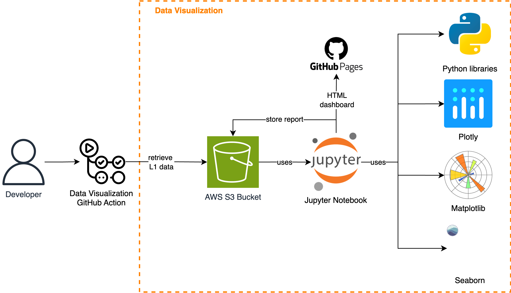
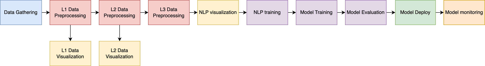

# Hotel Recommendation System using Google Places API and AWS Cloud Services


This project implements a complete CI/CD ML Pipeline that gathers hotel information from the Google Places API, stores it in an AWS S3 bucket, and utilizes AWS tools to preprocess, visualize, train, evaluate, and deploy the ML model.

All the reports and dashboards can be found at: https://norma-99.github.io/HotelRecommendationSystem/

## Table of Contents

- [Architecture](#architecture)
- [Pre-requisites](#pre-requisites)
- [Usage](#usage)
- [License](#license)
- [Contact](#contact)

## Architecture

### Flow of the Architecture



## Pre-requisites

This project requires both a Google Cloud account and an AWS account.

### AWS Account Setup

To create an AWS Free Tier account, visit the [AWS Console](https://signin.aws.amazon.com/signin?redirect_uri=https%3A%2F%2Faws.amazon.com%2Fmarketplace%2Fmanagement%2Fsignin%3Fref_%3Dfooter_nav_management_portal%26state%3DhashArgs%2523%26isauthcode%3Dtrue&client_id=arn%3Aaws%3Aiam%3A%3A015428540659%3Auser%2Faws-mp-seller-management-portal&forceMobileApp=0&code_challenge=p-4NnHTqm3ojLRxexOp1gybjzKDKuir2z2Ko6Q77Vsk&code_challenge_method=SHA-256), click on "Create a new AWS account," and follow the recommended steps.

Once you have access to the console, it is recommended to set up billing to ensure you do not exceed your budget. Go to:
Billing and Cost Management > Budgets > Overview and create a "My Zero-Spend Budget".

With your AWS account set up, you can follow the guidelines to create and set up the infrastructure automatically using Terraform. The entire process is detailed in the [Terraform README file](tf/README.md).

### Google Cloud Account Setup

To set up a Google Cloud account, follow these steps:

1. Go to the [Google Cloud Console](https://cloud.google.com/) and create a new project.
2. Enable billing for your project, as the Places API is a paid service. To ensure you stay within the $300 budget, consider the following costs: [Data Gathering Costs](documentation/billing.md).
3. Create a new project named `AndorraHotelsDataCollection`.
4. Enable the Places API: Navigate to the API Library and enable the "Places API" for your project.
5. Get your API key: Go to the Credentials page and create an API key. This key will be used to authenticate your requests to the Google Places API.
6. Enable Google Maps Geocoding API: Navigate to the Google Maps Geocoding API and enable it. 
7. Get your API key: Go to the credentials page and create an API key.


### SerpAPI account Setup

The last part consists of setting up SerAPI to be able to retreive 100 reviews for each hotel. 

1. Go to the [SerpAPI website](https://serpapi.com/).
2. Sign Up for an Account.
3. Log In to Your Account.
4. Access the API Key:
   - Once logged in, navigate to the "Dashboard".
   - In the dashboard, you will find your API key under the "API Key" section.
6. Save Your API Key: Copy the API key and keep it secure. You will use this key to authenticate your API requests.

### Set Up GitHub Pages and GitHub Token

In order to the Dashboards to work, we used GitHub pages, for that we enabled a personal access token with Workflows permissions and GitHub Pages. 

Enable GitHub Pages:
1.	Go to Repository Settings:
    - Navigate to the settings of your GitHub repository.
2.	Scroll to the GitHub Pages Section:
    - In the repository settings, scroll down to the “GitHub Pages” section.
3.	Select Branch:
    - In the “Source” dropdown, select the gh-pages branch.
4.	Save:
    - Click “Save” to enable GitHub Pages for your repository.

### Set Up Secrets

The final configuration step involves setting up AWS and GitHub secrets to enable GitHub Actions. While the API secrets can be tested locally, they must be stored securely for CI/CD pipeline execution. 

To use AWS Systems Manager Parameter Store:

1. Go to the AWS Management Console.
2. Navigate to “AWS Systems Manager” > "Parameter Store".
3. Create five new parameters for your credentials:
    ```json
    {
        "ADMIN_ACCESS_KEY_ID": "aws_access_key_id",
        "ADMIN_SECRET_ACCESS_KEY": "aws_secret_access_key",
        "GOOGLE_PLACES_API_KEY": "google_places_api_key",
        "GOOGLE_GEOCODING_KEY": "google_geocoding_api_key",
        "SERAPI_API_KEY": "serapi_api_key", 
    }
    ```
    - Select "Standard" tier and "Secure String".
4. A function called `get_secrets()` was created to retrieve this information.

For GitHub Actions:

1. Go to your GitHub repository.
2. Click on Settings > Secrets and Variables > Actions.
3. Add the following secrets: `AWS_ACCESS_KEY_ID`, `AWS_SECRET_ACCESS_KEY` and `GH_TOKEN`.


### Installations to test locally

Please install Python > 3.8 and all the requirements in the TXT file. Furthermore, you should also have Java installed, for MacOS follow the next commands:
```bash
brew install openjdk@11
export JAVA_HOME=$(/usr/libexec/java_home -v 11)
export PATH=$JAVA_HOME/bin:$PATH
source ~/.zshrc
```

## Usage

### Data Gathering

To obtain a dataset containing updated hotels and reviews for the Andorran region, and to ensure it is maintained and updated frequently, the Google Places API was utilized. Once the environment is set up, the only action required to retrieve the raw data into the S3 bucket is to navigate to your GitHub repository, go to Actions, and trigger the `1. Retrieve Hotel Raw Data` GitHub action. If the prerequisites have been set correctly, the GitHub action will pass, and the raw data will be stored in your `andorra-hotels-data-warehouse` bucket.

#### Data Gathering Architectural Design



#### Data Extraction Process

The data extraction process is performed by the GitHub action which follows these steps:

1. **Gather AWS and Google Cloud Credentials:**
   The action retrieves the necessary credentials to access both AWS and Google Cloud services.

2. **Access Google Places API:**
   The action uses the credentials to authenticate and connect to the Google Places API.

3. **Access SerpAPI:**
    The Action uses the credentials to authenticate and connect to the SerpAPI. 

4. **Make API Requests:**
   - **Find Hotels:** Utilize the Place Search request to find hotels in the specified region.
   - **Get Details:** Use the Place Details request to obtain detailed information about each hotel, including reviews.

5. **Define the Search Requests:**
   - To search for hotels in a specific region (e.g., Andorra la Vella), use the following endpoint:
     ```bash
     https://maps.googleapis.com/maps/api/place/textsearch/json?query=hotels+in+Andorra+la+Vella&key=YOUR_API_KEY
     ```
   - To get detailed information about a specific hotel, including reviews, use the Place Details request:
     ```bash
     https://maps.googleapis.com/maps/api/place/details/json?place_id=PLACE_ID&key=YOUR_API_KEY
     ```

6. **Download Data and Store in S3 Bucket:**
   The action downloads the data, including images, and stores them in the S3 bucket.

7. **Define JSON Dataset Format:**
   The data is structured in the following JSON format:
   ```json
   {
       "hotel_name": "Yomo Imperial Hotel",
       "location": "Avinguda Rocafort, 26, Sant Julià de Lòria",
       "rating": 4,
       "user_ratings_total": 1078,
       "max_number_of_people": 2,
       "address": "Av. Rocafort, 26, AD600 Sant Julià de Lòria, Andorra",
       "business_status": "OPERATIONAL",
       "place_id": "EXAMPLE_PLACE_ID",
       "amenities": {},
       "photos": [
           {
               "photo_reference": "EXAMPLE-PHOTO-REFERENCE",
               "s3_url": "https://andorra-hotels-data-warehouse.s3.amazonaws.com/raw_data/images/Sant Julià de Lòria/Yomo Imperial Hotel/EXAMPLE_PHOTO_NAME.jpg",
               "html_attributions": [
                   "<a href=\"https://maps.google.com/maps/contrib/EXAMPLE_REF\">Yomo Imperial Hotel</a>"
               ]
           },
           ...
       ],
       "reviews": [
           {
               "user": "Example User",
               "rating": 5,
               "date": "a year ago",
               "review": "Example Review"
           },
           ...
       ],
       "source": "https://maps.googleapis.com/maps/api/place/details/json?place_id=EXAMPLE_PLACE_ID"
   }

8. **Resulting Data in S3 bucket:** After execution, the following structure will be present in your S3 bucket: 

    ```
    - andorra-hotels-data-warehouse/
        - raw_data/
            - images/
                - Andorra La Vella/
                    - <Hotel Names>/
                        - <Hotel Image JPG>
                ...
            - text/
                - Andorra La Vella_<Date> JSON
    ```

This structure contains all corresponding images for each hotel as described in the JSON file. The overall process retrieves information for 50 hotels per region and 100 reviews per hotel. Additionally, all available images for each hotel are retrieved. Since Andorra has 7 regions, a total of information for 350 hotels is gathered.

### Data Preprocessing
For the data preprocessing process, we distinguished different types of data. Distinguishing between different data layers (raw data, L1 data, L2 data, and L3 data) is a common practice in data engineering and data science to manage the data transformation process effectively. Each layer represents a different stage of data processing, from the initial collection to the final form ready for analysis or modeling. Here are the definitions for each:



1. **Raw Data:**
   - Original reviews, ratings, and metadata collected from Google Places API.
   - Includes all raw text, images, and metadata without any preprocessing.

2. **L1 Data:**
   - Cleaned reviews and ratings, where missing values are handled, and irrelevant fields are removed.
   - Basic text cleaning (e.g., removal of HTML tags, lowercasing).

3. **L2 Data:**
   - Enriched reviews with additional features like sentiment scores, language translation.
   - Integration with other data sources such as hotel amenities and location data.
   - Feature engineering to create new columns like review length, average rating per hotel, etc.

4. **L3 Data:**
   - Final dataset ready for training the recommendation model.
   - Aggregated features, such as average sentiment score per hotel, overall ratings distribution.
   - Data split into training, validation, and test sets for model development.

By distinguishing between these data layers, we can maintain a clear and structured workflow, ensuring that each stage of data processing is well-defined and managed. This approach enhances data quality, traceability, and reproducibility, which are critical for effective data science and machine learning projects.

#### Data Preprocessing from Raw Data to L1 Data

Once the data gathering process has run successfully, the only action required to retrieve the L1 data into the S3 bucket is to navigate to your GitHub repository, go to Actions, and trigger the `2. Data Preprocessing` GitHub action and select the `l1` option. If the prerequisites have been set correctly, the GitHub action will pass, and the L1 data will be stored in our `andorra-hotels-data-warehouse` bucket. The following diagram demonstrates the L1 data preprocessing architectural design. 



To preprocess our hotel data for an NLP network, we need to extract and structure the features from the JSON file that are relevant for text-based analysis and potentially for training a recommendation model. Following, a step-by-step guide on how to preprocess the data to get an L1 data, ready for visualization and a second preprocessing round. 

1. **Load Data**:

    For the data treatment we used mainly PySpark. To load the data we followed the next steps:
    - Initialize PySpark.
    - Get the dataset schema.
    - Use `boto3` to load the data from the S3 bucket.
    - Load the JSON file into a data structure that allows for easy manipulation.

2. **Feature Extraction**:
    For our first data exploration and treatment, we decided to gather the following information: 
    - **Hotel General Information**:
        - `hotel_name`: original from Raw Data
        - `region`: Retrieved the region name from the JSON name
        - `address`: original from Raw Data
        - `rating`: original from Raw Data
        - `user_ratings_total`: original from Raw Data
        - `business_status`: original from Raw Data
        - `number_of_photos`: Retrieved the number of photos per hotel
    - **Review Information**: Extract individual reviews
        - `user`: original from Raw Data
        - `rating`: original from Raw Data
        - `date_in_days`: Transformed the review date to days
        - `review`: original from Raw Data
        - `translated review`: Translated the reviews from their original language using the `googletrans` library
        - `review language`: Detected the review language by using the `langdetect` library
    
3. **Text Preprocessing for NLP**:
    Furthermore, to the review texts we decided to add additional transformations so the text is readable by the user: 
   - **Lowercasing**: Convert all text to lowercase to maintain uniformity.
   - **Removing Punctuation**: Strip out punctuation marks.
   - **Removing `\r` and `\n` characters**: Removed enters or tabulations from the reviews.
   - **Extracted the Review Language**: For each review got the Review language to ensure its suitable for NLP processes.
   - **Translated Reviews**: If needed the reviews were translated to English. 

4. **Store the Preprocessed Data in the S3 bucket**
    After execution, the following structure will be present in your S3 bucket: 
    ```
    - andorra-hotels-data-warehouse/
        - l1_data/
            - text/
                - l1_data_<Date> CSV
    ```

    This structure contains all corresponding data after the first preprocessing phase. The overall process retrieves useful information from our Raw Data dataset and stores the result in an S3 bucket.

#### Data Preprocessing from L1 data to L2 data

The second preprocessing step involves converting the L1 data into L2 data. Visualizing our resulting L1 data enabled us to identify unnecessary columns and explore further feature extraction possibilities. To trigger this preprocessing step, navigate to your GitHub repository, go to Actions, and initiate the `2. Data Preprocessing` GitHub action, selecting the `l2` option. If all prerequisites are set correctly, the GitHub Action will execute successfully, and the L2 data will be stored in our `andorra-hotels-data-warehouse` bucket. The following diagram illustrates the L2 data preprocessing architectural design.



To enhance the hotel data for comprehensive analysis, we employed the following techniques:

1. **Remove Duplicates**: Ensured the data is clean by removing any duplicates in the dataset.

2. **Drop Unnecessary Columns**: The following columns were removed:
    - `review_text`: Only translated reviews were used.
    - `number_of_photos`: Since only 10 photos per review were gathered, this feature is irrelevant for training.
    - `business_status`: Visualization of L1 data showed that 99% of hotels had `OPERATIONAL` status, making this feature irrelevant.
    - `review_user`: User reviews do not impact model training.

<!-- 3. **Calculate Review Length**: Retrieved each review's character length. -->

3. **Remove Empty Reviews**: Dropped all empty reviews as they are not useful for NLP training.

<!-- 5. **Text Tokenization**: Performed the following text transformations:
    - Tokenized the text, converting reviews into arrays of words.
    - Removed any remaining stopwords.
    - Computed Hashing Term Frequency (TF) to understand word frequency in documents.
    - Computed Inverse Document Frequency (IDF) to understand word importance across the dataset.
    - Combined TF-IDF features with the original dataset and dropped intermediate columns (`words`, `filtered`, `raw_features`). -->

4. **Calculate Distances to Ski Resorts and City Center**: Assessed the hotel's connectivity by computing the distance to the city center and the nearest ski resort using the Google Geocoding Database for hotel latitude and longitude.

5. **Data Shuffle**: Shuffled the data to prepare it for splitting into training, validation, and testing datasets.

Once these processes were completed, the data was saved in the `andorra-hotels-data-warehouse` S3 bucket.


#### Data Preprocessing from L2 data to L3 data

The third and final preprocessing step involved converting the L2 data into L3 data prepared for NLP treatment. To trigger this preprocessing step, navigate to GitHub repository, go to Actions, and initiate the `2. Data Preprocessing` GitHub Action, selecting the `l3` option. If all prerequisites are set correctly the GitHub Action will execute successfully, and the L3 data will be stored in our `andorra-hotels-data-warehouse` bucket. The following diagram illustrates the L3 preprocessing architectural design. 

\

To prepare the data for model training we employed the following techniques: 

1. **Aggregate groups**: We aggregated the languages that had a less than 2% presence to avoid overfitting. 

2. **One hot encoding**: We one-hot encoded the `region` and the `review_lang` features to interpret categorical data more effectively.

3. **Categorical encoding**: We encoded categorically the `hotel_name` feature, giving it an ID for future hotel name retrieval at evaluation. 

4. **Drop Unnecessary columns**: We dropped the `latitude` and `longitude` columns since the information was already encoded in another features. 

Once these processes were completed, the data was saved in the `andorra-hotels-data-warehouse` S3 bucket.


### Data Visualization

After every preprocessing step, the corresponding visualization dashboard should be triggered. Visualizing the data once it is preprocessed is a key factor since it allows for the identification of patterns, trends, and anomalies that can inform further analysis, improve model accuracy, and support decision-making by providing clear and interpretable insights.
Hence, to obtain your visualization dashboard go to GitHub repository, go to Actions, and trigger the corresponding viusalization GitHub Action.

The following diagram demonstrates the L1 and L2 data visualization architectural design. 



#### Data Visualization from Raw Data to L1 data
To execute the first visualization dashboard click on the `3. Data Visualization` GitHub action and select the `l1` option. If the prerequisites have been set correctly, the GitHub action will pass, and the dashboard report will be available in the GitHub Pages link. 

For the first visualization dashboard, a Jupyter notebook with the following plots was created: 
1. Distribution of Ratings
    - **Histogram of Ratings:** Histogram and table of the distribution of hotel ratings.
    - **Average Rating per Region:** Bar chart and table showing the average rating of hotels in each region.

2. Reviews Analysis
    - **Number of Reviews per Hotel:** Bar chart and table showing the total number of reviews for each hotel.
    - **Review Count Comparison:** Bar chart comparing the number of reviews between regions.
    - **Review Count over Time:** Line chart showing the number of reviews over time to identify trends.

<!-- 3. Text Analysis
    - **Word Cloud of Review Text:** Highlight the most frequent words in the reviews.
    - **Language Distribution:** Pie chart showing the distribution of review languages.
    - **Sentiment Analysis:** Bar chart or pie chart showing the distribution of positive, neutral, and negative sentiments in reviews. -->

<!-- 4. Comparison between Regions
    - **Sentiment Comparison:** Bar chart comparing sentiment distributions across regions. -->

5. Business Status Analysis
    - **Business Status Distribution:** Pie chart showing the distribution of business status (open, closed, etc.).

Once the dashboard was created it pushed the report both to GitHub Pages and to the  `andorra-hotels-data-warehouse` S3 bucket. 

#### Data Visualization from L1 data to L2 data

To execute the second visualization dashboard click on the `3. Data Visualization` GitHub action and select the `l2` option. If the prerequisites have been set correctly, the GitHub action will pass, and the dashboard report will be available in the GitHub Pages link. 

For the second visualization dashboard, a Jupyter notebook with the following plots was created: 
<!-- 1. **Review Length Distribution:** Plot the length of each review and its frequency. -->

2. **Distance to Ski resorts:** Plot the minimum distance to a ski resort and its frequency.

3. **Distance to city center:** Plot the minimum distance to the city center per hotel, and its frequency. 

4. **Ratings vs Distance to Ski resort:** Plot the average rating of a hotel based on the distance to a ski resort.

5. **Ratings vs Distance to city center:** Plot the average rating of a hotel based on the distance to the city center.

<!-- 6. **Review Text Features:** The plot that visualizes the distribution of values for each feature extracted from the `review_text_features` column in the dataset. 
Each subplot represents the distribution of one of the features across all reviews, showing how frequently each value occurs. -->

Once the dashboard was created it pushed the report both to GitHub Pages and to the  `andorra-hotels-data-warehouse` S3 bucket. 


### Model Training

We opted for a two-folded Model Training technique. Started with NLP Evaluation dashboard and then added a supervised learning model. 

#### NLP Dashboard and final implementation

Once you gather your L3 data, the next step is to process our `review_text_translated` feature using NLP techniques. For that, we created a dashboard file called `data_visualization_nlp.ipynb` where 6 different NLP techniques are applied to the text feature and some visualization aids are given so the ML experts can decide which techniques to apply inside the final model. 

To execute the NLP visualization dashboard click on the `3. Data Visualization` GitHub action and select the `nlp` option. If the prerequisites have been set correctly, the GitHub action will pass, and the dashboard report will be available in the GitHub Pages link. 

The NLP techniques used are the following: 

1. **TF-IDF (Term Frequency-Inverse Document Frequency):** TF-IDF is a well-established method that helps identify the importance of words in a document relative to the entire dataset. It balances the frequency of words with their distinctiveness across the dataset, which is crucial when dealing with a large number of reviews.

2. **Word Embeddings (Word2Vec):** Word embeddings capture the semantic meaning of words in a continuous vector space, where words with similar meanings are close to each other. This is particularly useful for capturing nuances in review text.

3. **N-grams (Bi-grams):** While individual words are informative, certain combinations of words (like "not good," "highly recommend") carry significant meaning. N-grams can help capture these phrases.

4. **Sentiment Analysis:** Sentiment polarity (positive, negative) and intensity can be directly related to the ratings. A strongly positive review is likely to have a higher rating, and vice versa.

5. **Review length distribution:** The length of the review might correlate with the detail and thoroughness of the review, which in turn might influence the rating.

6. **Topic Modeling (LDA - Latent Dirichlet Allocation):** LDA can uncover hidden topics within reviews, which might correlate with different ratings. For example, reviews discussing "cleanliness" might have different ratings than those discussing "location."

Once the dashboard was created it pushed the report both to GitHub Pages and to the  `andorra-hotels-data-warehouse` S3 bucket. 


After the Dashboard is executed, the ML expert should decide which of these 6 techniques are going to be fruitful for the later ML training, and compute the `nlp_training.py` logic. To do so, go to your GitHub Actions, click on the `4. Model Training` GitHub Action and select the `nlp` option. In the arguments, select which NLP technique should be used for the training and execute the action. 

The action will then add the NLP techniques into your dataset and do a final preparation (such as normalizing the data) for the final ML training. 

#### ML Model
TODO

### Model Evaluation
TODO

### Model Deployment
TODO


After completing all the GitHub Actions, you should have a successful model deployed in a Cloud environment, the flow diagram of the actions required are the following:



## License

### 1. License Grant

Permission is hereby granted, free of charge, to any person obtaining a copy of this software and associated documentation files (the "Software"), to deal in the Software without restriction, including without limitation the rights to use, copy, modify, merge, publish, distribute, sublicense, and/or sell copies of the Software, and to permit persons to whom the Software is furnished to do so, subject to the following conditions:

### 2. Compliance with External API Terms

Users of this Software are required to comply with the terms of service and usage policies of any external APIs integrated with the Software, including but not limited to:

- [Google APIs Terms of Service](https://developers.google.com/terms)
- [AWS Service Terms](https://aws.amazon.com/service-terms/)

### 3. Attribution

The Software must include an acknowledgment that it utilizes external APIs provided by Google, AWS, and any other third-party services used in the project. This acknowledgment must be included in the end-user documentation, including a link to the relevant terms of service.

### 4. Disclaimer of Warranty

THE SOFTWARE IS PROVIDED "AS IS", WITHOUT WARRANTY OF ANY KIND, EXPRESS OR IMPLIED, INCLUDING BUT NOT LIMITED TO THE WARRANTIES OF MERCHANTABILITY, FITNESS FOR A PARTICULAR PURPOSE, AND NONINFRINGEMENT. IN NO EVENT SHALL THE AUTHORS OR COPYRIGHT HOLDERS BE LIABLE FOR ANY CLAIM, DAMAGES, OR OTHER LIABILITY, WHETHER IN AN ACTION OF CONTRACT, TORT, OR OTHERWISE, ARISING FROM, OUT OF, OR IN CONNECTION WITH THE SOFTWARE OR THE USE OR OTHER DEALINGS IN THE SOFTWARE.

### 5. Limitation of Liability

IN NO EVENT SHALL THE AUTHORS OR COPYRIGHT HOLDERS BE LIABLE FOR ANY DIRECT, INDIRECT, INCIDENTAL, SPECIAL, EXEMPLARY, OR CONSEQUENTIAL DAMAGES (INCLUDING, BUT NOT LIMITED TO, PROCUREMENT OF SUBSTITUTE GOODS OR SERVICES; LOSS OF USE, DATA, OR PROFITS; OR BUSINESS INTERRUPTION) HOWEVER CAUSED AND ON ANY THEORY OF LIABILITY, WHETHER IN CONTRACT, STRICT LIABILITY, OR TORT (INCLUDING NEGLIGENCE OR OTHERWISE) ARISING IN ANY WAY OUT OF THE USE OF THIS SOFTWARE, EVEN IF ADVISED OF THE POSSIBILITY OF SUCH DAMAGE.

### 6. Indemnification

You agree to indemnify, defend, and hold harmless the authors and copyright holders from any and all claims, liabilities, damages, losses, or expenses (including reasonable attorneys' fees and costs) arising out of or in any way connected with your use of the Software, violation of this License, or violation of any rights of another.

### 7. Changes to the License

The authors reserve the right to modify this license at any time. Any changes will be documented and will apply only to versions of the Software released after the date of the modification.

By using this Software, you acknowledge that you have read and understood this License, and agree to be bound by its terms and conditions.

## Contact

For questions or feedback, please contact:

- Email: normagutiesc@gmail.com
- GitHub: [Norma-99](https://github.com/Norma-99)